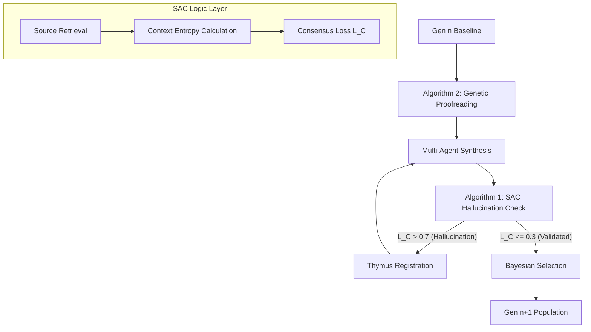

# System Architecture

The **BioNexus-Dialectical-Protocol** is designed as a modular, decentralized AI evolution system that mimics biological proofreading and immune memory.

## 🧱 Core Components

1.  **Dialectical Protocol Engine (`core/dialectical_protocol/`)**
    - Manages a multi-agent committee (Synthesis, Criticism, Refinement).
    - Implements **Algorithm 1 (Dialectical Immunity)** for macro-level validation.
2.  **Genetic Proofreading Layer (`core/proofreader/`)**
    - Implements **Algorithm 2 (Genetic Proofreading)** for micro-level repair.
    - Ensures syntax and type-check fidelity before adversarial audit.
3.  **Source-Anchored Consensus (SAC) (`core/sac_algorithm/`)**
    - A logic layer that cross-references AI-generated claims with trusted sources.
    - Calculates *Consensus Loss (L_C)* to detect hallucinations.
4.  **Digital Thymus (`core/digital_thymus/`)**
    - A persistent immune memory that stores "negative knowledge" (logical pathogens).
    - Prevents recurrent hallucinations using the SAC results.

## 🧬 Evolutionary Workflow

## 📐 Vibe Coding Formalization
Vibe Coding is a mapping $\phi: \mathcal{V} \times \mathcal{M} \rightarrow \mathcal{C}$ where $\mathcal{V}$ is semantic intent, $\mathcal{M}$ is biological metaphor, and $\mathcal{C}$ is executable code space.

Example:
- **Vibe**: "T-Cell (Audit): identify discordant genotypes"
- **Code**: `def audit(df): return df[df['geno'] != df['pheno']]`

## 📐 Mathematical Grounding (SAC Algorithm)
The **Consensus Loss ($L_C$)** is defined as:
$$L_C = \alpha \cdot \mathcal{D}_{KL}(C || S) + \beta \cdot H(\text{Context})$$

## 💾 Digital Thymus: Persistent Immune Memory
The Thymus acts as an immutable ledger of **Pathogenic Co-occurrences** (e.g., `AjTERT` ↔ `Fibonacci_Seeding`).
