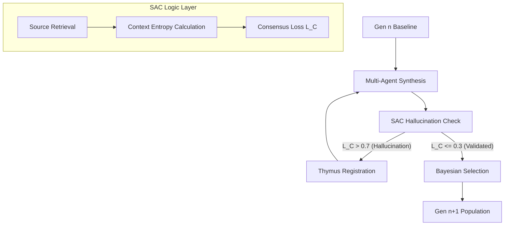

# System Architecture

The **BioNexus-Dialectical-Protocol** is designed as a modular, decentralized AI evolution system that mimics biological proofreading and immune memory.

## 🧱 Core Components

1.  **Dialectical Protocol Engine (`core/dialectical_protocol/`)**
    - Manages a multi-agent committee (Synthesis, Criticism, Refinement).
    - Implements stochastic crossover and Bayesian weighted selection.
2.  **Source-Anchored Consensus (SAC) (`core/sac_algorithm/`)**
    - A logic layer that cross-references AI-generated claims with trusted genomic/proteomic sources.
    - Calculates *Consensus Loss (L_C)* to detect hallucinations.
3.  **Digital Thymus (`core/digital_thymus/`)**
    - A persistent immune memory that stores "negative knowledge" (known hallucinations) and "positive tokens" (verified facts).
    - Prevents recurrent hallucinations across generations.

## 🧬 Evolutionary Workflow

## 📐 Mathematical Grounding (SAC Algorithm)
The **Consensus Loss ($L_C$)** is defined as the divergence between the generated claim ($C$) and the grounded source artifacts ($S$):

$$L_C = \alpha \cdot \mathcal{D}_{KL}(C || S) + \beta \cdot H(\text{Context})$$

Where:
- $\alpha, \beta$: Weighting coefficients for source divergence and context entropy.
- $H(\text{Context})$: Measures the uncertainty of the agent's internal state.

## 💾 Digital Thymus: Persistent Immune Memory
The Thymus acts as an immutable ledger of "Negative Knowledge". Once an entity pair (e.g., `AjTERT` ↔ `Fibonacci_Seeding`) is registered as a logical pathogen, the Dialectical Engine automatically prunes any future synthesis paths containing this invalid co-occurrence.
